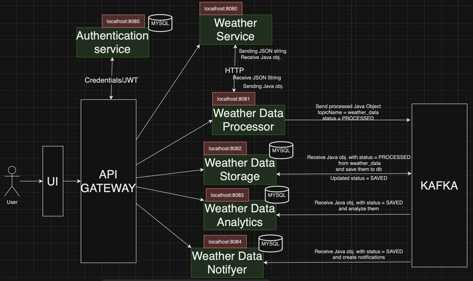

# Weather Monitoring Application

## Project Description
This project is a weather monitoring application consisting of microservices that collect, process, store, analyze, and notify users about weather data. Each microservice is designed to perform a specific task, contributing to the overall functionality of the system.

## Microservices Overview
1. **Weather Service (Producer)**: Gathers weather data from various sources and sends it to the `weather_data_topic` in Kafka.
2. **Weather Data Processor (Consumer)**: Receives data from the `weather_data_topic`, processes it (e.g., aggregates data), and passes the results.
3. **Weather Data Storage (Consumer)**: Gets processed data from Weather Data Processor and stores it in the database.
4. **Weather Data Analytics (Consumer)**: Performs analytics on stored data, identifying trends or generating reports.
5. **Weather Data Notifier (Consumer)**: Sends notifications to users about weather changes.

## Diagram
For a visual representation of the project's architecture, refer to the included diagram.

## Topics and Data
- **Topic**: `weather_data_topic`
    - Data: WeatherEvent objects containing weather information.

## Groups
1. **WeatherDataProcessorGroup**:
    - Microservices: Weather Data Processor

2. **WeatherDataStorageGroup**:
    - Microservices: Weather Data Storage

3. **WeatherDataAnalyticsGroup**:
    - Microservices: Weather Data Analytics

4. **WeatherDataNotifierGroup**:
    - Microservices: Weather Data Notifier

## System Workflow
1. Weather Service collects weather data (temperature, humidity, pressure, etc.) from various sources.
2. Weather Service sends the data to the `weather_event` topic in Kafka.
3. Weather Data Processor (part of WeatherDataProcessorGroup) receives data from `weather_data_topic`, processes it (e.g., aggregates), and passes it on.
4. Weather Data Storage (part of WeatherDataStorageGroup) receives processed data from Weather Data Processor and stores it in the database.
5. Upon successful data storage, Weather Data Storage sends a "DATA_SAVED" message to the `data_saved_topic`.
6. Weather Data Analytics (part of WeatherDataAnalyticsGroup) receives "DATA_SAVED" from `data_saved_topic` and performs analysis on stored data.
7. Weather Data Notifier (part of WeatherDataNotifierGroup) also receives "DATA_SAVED" and sends weather change notifications to users.

Each microservice performs a unique task, and groups organize consumers with similar functionality for efficient message processing in Kafka.

## Microservices APIs

1. **Weather Service API**:
    - `/api/v1/weather?cityName` - GET request to get current weather for a specific location.

   Example: http://localhost:9191/api/v1/weather?cityName=Odesa

2. **Weather Data Processor API**:
    - `/api/v1/process` - GET request to get aggregated weather data (e.g., average temperature) for a specified time period.

3. **Weather Data Storage Service API**:
    - `/api/v1/storage/{city}/{date}` - GET request to retrieve stored weather data for a specific location and time.

   Example: http://localhost:9191/api/v1/storage/Odessa/2023-08-01

4. **Notification Service API**:
    - `/api/v1/notify/all` - GET request to get all active email subscriptions.
    - `/subscribe?cityName=Odesa&weather=Rain` - POST request to subscribe to weather notifications for a specific location and weather type.
    - `/unsubscribe?cityName=Odesa&weather=Rain` - POST request to unsubscribe from weather notifications.
    - `/unsubscribe/all` - POST request to unsubscribe from all notifications.

   Examples:
    - http://localhost:9191/api/v1/notify/subscribe?cityName=Odesa&weather=Rain
    - http://localhost:9191/api/v1/notify/all

5. **Analytics Service API**:
    - `/api/v1/analytic/avgtemp?cityName&startDate&endDate` - GET request to get average temperature analytics for a specific location and time period.
    - `/api/v1/analytic/weather?cityName&startDate&endDate` - GET request to get weather analytics for a specific location and time period.

   Examples:
    - http://localhost:9191/api/v1/analytic/avgtemp?city=Odessa&startDate=2023-07-01&endDate=2023-08-01

6. **Authentication Service API**:
    - `/api/v1/auth/login` - POST request to login with credentials.
    - `/api/v1/auth/register` - POST request to register a new user.
    - `/api/v1/auth/validate?token` - GET request to validate JWT token.
